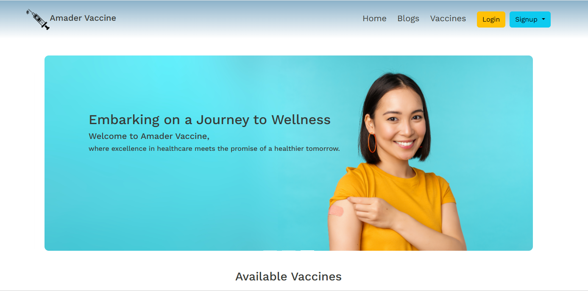

# Amader Vaccine

Amader Vaccine is a web application , developed with Django MVT (Model-View-Templates)-a powerful python web framework which connects patients and doctors for the purpose of administering and sharing vaccines via the internet. Providing a one-stop center for vaccinations, with a dedicated user role for both doctors and patients to take and administer the vaccine online.

[Live Link](https://amader-vaccine.onrender.com/)  

### Special Requests

- Please wait while it loads the full page. It takes time to activate the hosting as the developer is using a free deployment package. 
- Please use a PC to render the website because it is not yet responsive (The developer is too lazy) 
- Thanks for your patience !  

## Features

 - Serves as a comprehensive platform for vaccinations, featuring dedicated user roles for doctors and patients to manage vaccines and receive doses online.
 - Bootstrap ensures a smooth user interface experience, with sign-up requiring role selection and email verification.
 - Doctors can manage vaccines, while patients can receive vaccinations and provide reviews.
 - Includes a blog section for staying informed about diseases and pandemics, allowing both patients and doctors to create, edit, and delete blog posts.
 - Access to read blogs is available for both registered and non-registered users.

## Tech Stack

**Client:** Bootstrap

**Server:** Django
